# **计算机组成与实践** -**存储体系结构**

## 一.**简介**

### **计算机主要组成部件**

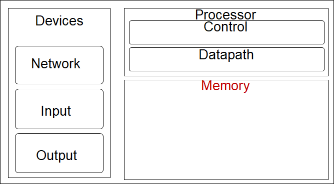

### **存储“墙”问题**

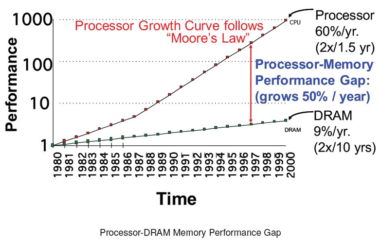

#### **存储器发展**

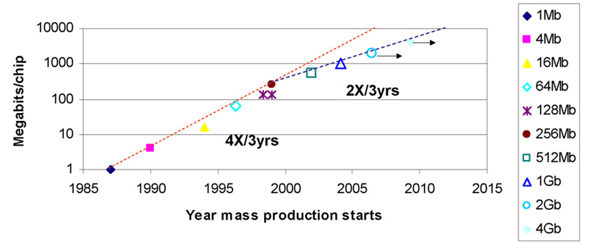

#### **存储系统**

存储器容量由寻址策略决定

| **例如：**                                     |
| ---------------------------------------------- |
| 采用16位地址，寻址空间大小为2^16=65536存储单元 |

大多数存储器是字节可寻址（byte-addressable）

每个存储单元的大小为1字节

大多数计算机以字为单位（word）检索或存储数据

常用缩写：

> 1K ≈ 2^10（Kilo）
>
> 1M ≈ 2^20（Mega）
>
> 1G ≈ 2^30（Giga）
>
> 1T ≈ 2^40（Tera）

#### **主存访问模式**

数据传输通过

- MAR：地址寄存器
- MDR：数据寄存器

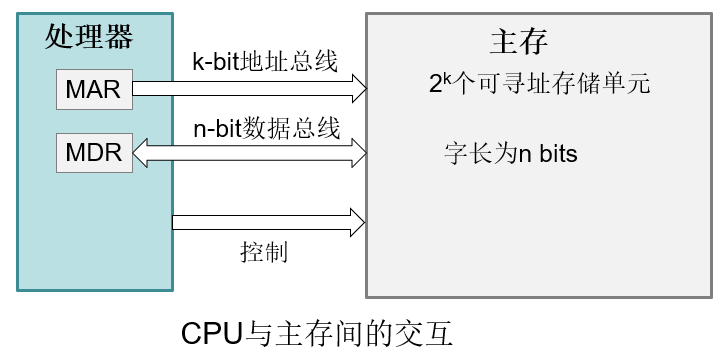

#### **主存的基本结构**

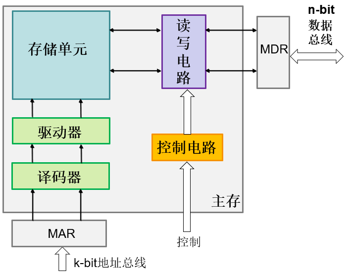

#### **存储系统设计**

处理器的运行速度远快于存储访问速度

- 小容量访问速度快，大容量访问速度慢
- 设计缓存存储常用数据加速存储访问速度

内存容量有限：

- 使用虚拟存储器增加内存容量
- 内存管理单元（memory management unit，MMU）进行虚拟地址与物理地址之间的转换

#### **局部性原理**

程序局部性的访问地址空间

| **时间局部性（Temporal locality）**                    |
| ------------------------------------------------------ |
| 如果某个数据项被访问，那么在不久的将来它可能再次被访问 |

例如，loop循环中的指令

| **空间局部性（Spatial locality）**                           |
| ------------------------------------------------------------ |
| 如果某个数据项被询问，与它地址相邻的数据项可能很快也将被访问 |

例如，顺序的指令执行，数组数据等

##### **利用局部性原理**

- 存储层次结构（Memory hierarchy）
- 所有数据存储在磁盘
- 最近访问的数据（相邻数据）从磁盘拷贝到较小的DRAM存储器
  - 主存（Main memory）
- 最近经常访问的数据（相邻数据）从DRAM拷贝到更小的SRAM存储器
  - 缓存（Cache）

#### **存储体系结构**

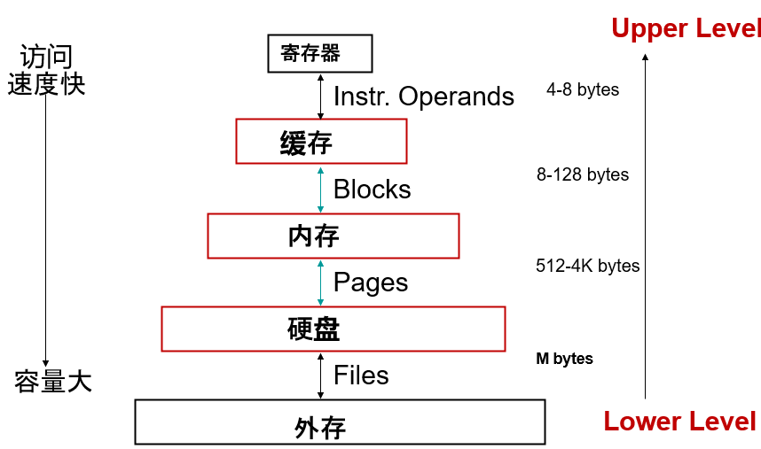

#### **计算机的存储器是如何运作的**

https://www.bilibili.com/video/av19939336/

#### **相关术语**

| **随机访问存储器（Random Access Memory, RAM）**              |
| ------------------------------------------------------------ |
| 根据地址访问存储空间中的单元  Ø存储空间中的任意地址的访问时间相同 |

| **块（Block）**          |
| ------------------------ |
| 缓存中数据交换的最小单元 |

命中率（Hit Rate）：在高层存储器中找到目标数据的存储访问比例

缺失率（Miss Rate）：在高层存储器中不能找到目标数据的存储访问比例，Miss Rate = 1 - Hit Rate

| **命中时间（Hit Time）**                                     |
| ------------------------------------------------------------ |
| 访问某存储器层次结构所需的时间，包括了判断当前访问是命中还是缺失所需的时间 |

| **缺失代价（Miss Penalty）**                                 |
| ------------------------------------------------------------ |
| 将相应的块从低层存储器器替换到高层存储器所需的时间，包括访问块、将数据逐层传输、将数据插入缺失的层和将目标块传递给请求者的时间 |

命中时间 << 缺失代价

#### **带宽和延迟**

- 带宽（Bandwidth）
  - 描述数据传输时每秒传输的数据量（bits or bytes）
- 延迟（Latency）
  - 发出访问信号到开始传输第一个字的时间
  - 以时钟周期为单位

## 二.**寄存器**

### **基于反馈的存储**

给两个反相器加上反馈信号

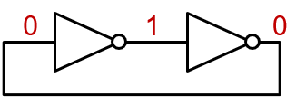

通常称为交叉耦合反相器（Cross-coupled Inverter）

稳定存储1 bit数据的方式

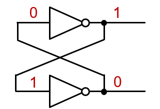

### **S-R锁存器（latch）**

- 用或非门替换反相器

- **S-R锁存器（set-reset Latch）**

  > 这个是数电讲过的东西吧

| **锁存器（latch）**                                          |
| ------------------------------------------------------------ |
| 一种存储元件，它的输出与内部存储的状态一致，并且当时钟有效时，只要输入发生变化，存储状态就会随之发生变化。 |

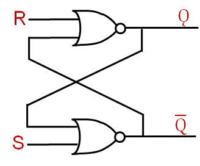

| input |      | output |
| ----- | ---- | ------ |
| A     | B    | (A+B) ̅ |
| 0     | 0    | 1      |
| 1     | 0    | 0      |
| 0     | 1    | 0      |
| 1     | 1    | 0      |

根据不同的R，S输入，Q的值

- R=S=0：Q=1(其实是保持上次信号，Q不一定是1)
- S=0，R=1：Q=0
- S=1，R=0：Q=1
- R=S=1：亚稳定状态

> S是set，置位1
>
> R是reset，复位0

### D锁存器

D锁存器：

- 两个输入：要存储的数据D，时钟信号C
- 两个输出：输出信号Q，其反向信号Q ̅
- 当输入时钟C有效时，锁存器称为打开状态，此时输出信号Q 的值为输入信号D 的值。
- 当输入时钟无效时，锁存器处于关闭状态，输出信号Q 等于锁存器最后一次打开时所存储的数据。

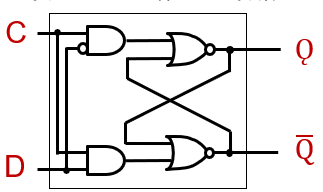

### **D触发器（flip-flop）**

| **触发器（flip-flop）**                                      |
| ------------------------------------------------------------ |
| 一种存储元件，它的输出与内部存储的状态一致，并且内部状态只在时钟的边沿发生变化。 |

- 下降沿触发的D触发器
  - 第一个锁存器称为主锁存器，第二个锁存器称为从锁存器
  - 当输入时钟C有效时，主锁存器打开，输入数据D。
  - 当输入时钟C被拉低时，主锁存器关闭，但第二个锁存器打开，并且主锁存器的输出作为第二个锁存器的输入信号。

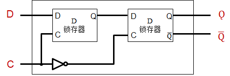

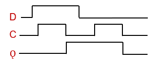

### **寄存器**

D触发器构造寄存器

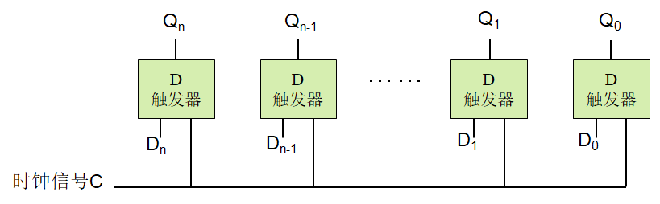

## 三.**随机访问存储器（RAM）**

### **静态随机存储器（SRAM）** 

- 存储1 bit数据需要6个晶体管
- 大多数芯片使用SRAM
- 一对弱交叉耦合反相器
- 数据存储在交叉耦合反相器

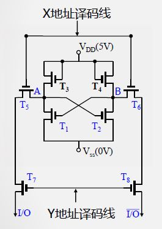

> X地址译码线（行选通）
>
> Y地址译码线（列选通）
>
> T1、T2保存数据；
> T3、T4补充电荷；
>
> T5、T6、T7、T8开关作用

#### **静态存储器结构**

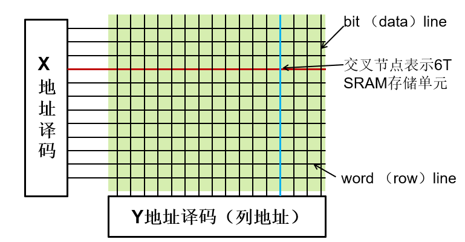

- N位地址，寻址2n个存储单元，2n/2+1根译码线
- 一行存储1 block数据（word line），列地址（bit line）选择请求访问的字节或字

> 按块存取，而非字节（具体取字节在内存中）

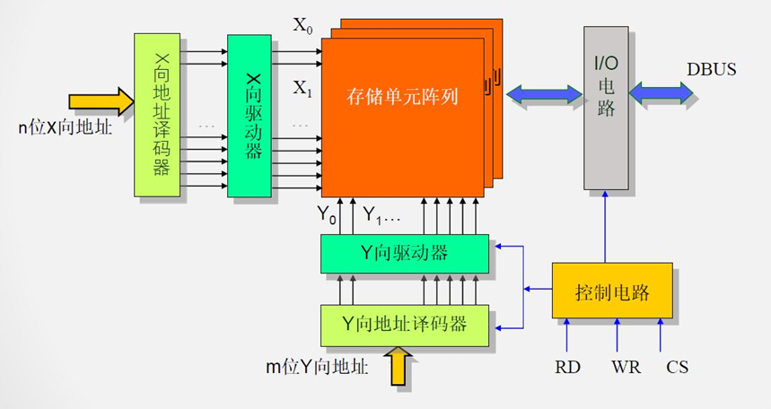

### **动态随机存储器（DRAM）** 

#### **1-T DRAM存储单元**

- 1个晶体管
- 需要一个存储电容（Capacitor）
- 提高存储密度
- 电容存储数据，有电荷为1，否则是0

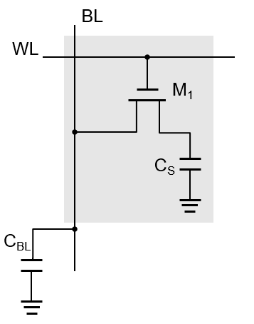

#### **动态存储器结构**

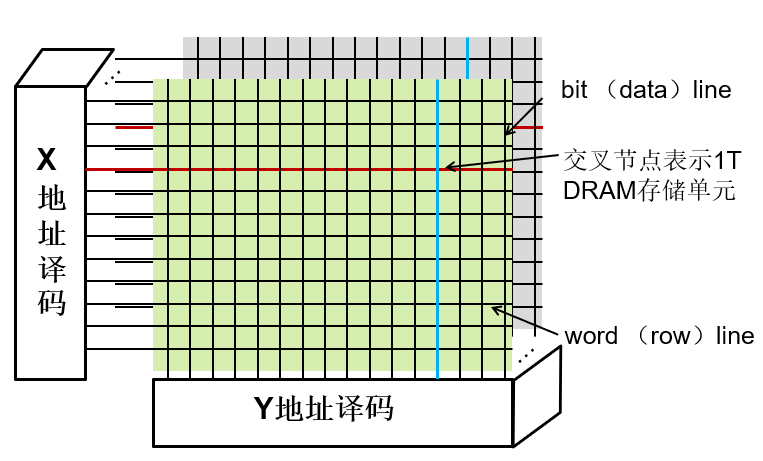

#### **DRAM技术**

- 存储单元使用电容保存电荷的方式来存储数据
  - 使用一个晶体管对电容进行访问
  - 必须周期性的刷新才能保持数据
    - 读出内容再写回
    - 对一整行数据进行刷新

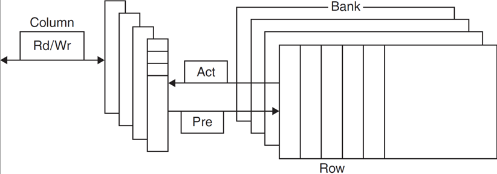

#### **DRAM的优化**

- DRAM中的bit以矩形数组的结构组织排列
  - DRAM访问一整行数据
  - 突发模式（burst mode）：减少从行中连续访问字的开销
- 双倍数据速率（Double data rate, DDR）DRAM
  - 在时钟的上升沿和下降沿传输数据，以获得双倍的数据带宽
- 四倍数据速率（Quad data rate, QDR）DRAM
  - 将DDR的传输数据线路分为输入和输出，以获得四倍的数据带宽

#### **影响DRAM性能的因素**

- 行缓冲器（Row buffer）
  - 允许同时访问和刷新多个字的数据
- 同步DRAM（Synchronous DRAM）
  - 以突发方式连续访问数据时，不需要发送所有字的地址
  - 增加带宽
- DRAM划分存储块（banking）
  - 支持多个存储块的并发访问
  - 增加带宽

### **1到4代内存规格变化**

| **内存规格** | **时钟频率** | **数据传输率** | **数据传输带宽** |
| ------------ | ------------ | -------------- | ---------------- |
| SDRAM-133    | 133MHz       | 133MT/s        | 1.06GB/s         |
| DDR-266      | 133MHz       | 266MT/s        | 2.1GB/s          |
| DDR2-533     | 133MHz       | 533MT/s        | 4.2GB/s          |
| DDR3-1066    | 133MHz       | 1066MT/s       | 8.5GB/s          |
| DDR3-1600    | 200MHz       | 1600MT/s       | 12.8GB/s         |
| DDR4-2133    | 133MHz       | 2133MT/s       | 21.3GB/s         |
| DDR4-3200    | 200MHz       | 3200MT/s       | 25.6GB/s         |

## 四.**交叉存取（Interleaving）**

### **存储控制器（Memory Controller）**

- 控制处理器与存储器间交互
- DRAM需要频繁刷新， 并且使用时分复用信号减少引脚数
- SRAM管理简单，通常不需要存储控制器

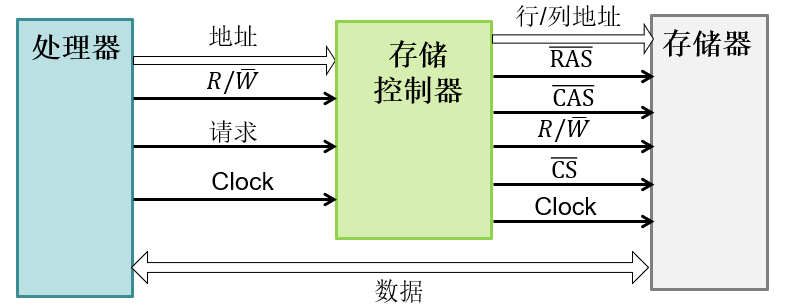

RAS（CAS）：行（列）地址选通，CS：片选信号

### **存储控制器**

- 存储控制器接收处理器发送的访问地址和R/W信号
- 生成RAS和CAS信号
- 在RAS信号的控制下，部分高位地址作为行地址，选通存储结构中的某一行
- 在CAS信号的控制下，部分低位地址作为列地址，在选通的某一行存储结构中的选通某一列
- 根据地址选中相应的存储模块后，建立处理器与存储器间的数据线路
- DRAM需要频繁刷新，但是刷新开销少于总存储访问时间的1%

### **存储模块交叉**

- 处理器和缓存访问速度快，内存访问慢
- 可以通过交叉访问几个存储模块来隐藏访问延迟
- 每个存储模块都有自己的地址缓冲寄存器（Address Buffer Register，ABR）和数据缓冲寄存器（Data Buffer Register，DBR）

#### **存储模块交叉存取**

处理器和缓存访问速度快，内存访问慢

可以通过交叉访问几个存储模块来隐藏访问延迟

每个存储模块都有自己的地址缓冲寄存器（Address Buffer Register，ABR）和数据缓冲寄存器（Data Buffer Register，DBR）

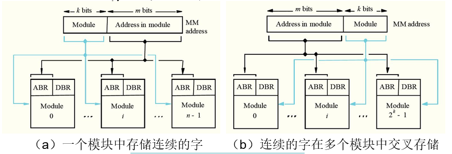

**哪种策略更好？**

两个或多个兼容的存储模块

在一个存储模块中，采用多个并行访问的片

| **例如：**                                               |
| -------------------------------------------------------- |
| 8个存储模块，每个模块有8个片，实现8×8=64 bit的存储器总线 |

交叉存储可以在类似双通道内存架构中实现

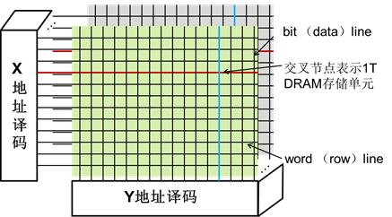

### **非交叉存储V.S.交叉存储**

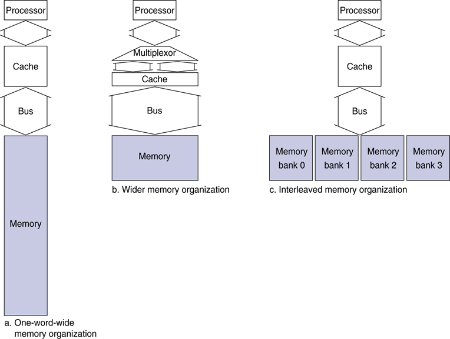

#### **交叉存取例子**

假设指令访问数据缓存发生read miss，需要从内存将数据读入缓存

缓存块大小为8 bytes

假设发送地址到内存花费1 个时钟周期，从内存发送数据花费1个时钟周期

此外，内存的访问延迟为6个时钟周期，即从接收到地址到发送第一个字节需要6个时钟周期

访问相同行的字节的延迟为4个时钟周期

#### **非交叉存取**

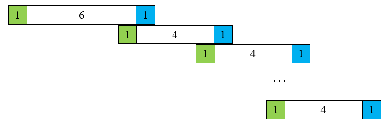

访问第一个字节需要6 cycles

假设所有随后的字节都在同一行，每个需要4 cycles

| **非交叉存取**        |
| --------------------- |
| 1+6+7×4+1=  36 cycles |

#### **4个模块交叉存取**

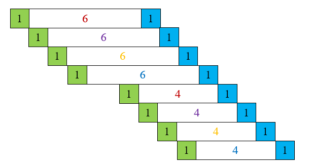

| **交叉存取**        |
| ------------------- |
| 1+6+1×8=  15 cycles |

#### **课题练习**

如果只有2个模块交叉存取，传输8 bytes数据，需要多少个时钟周期？

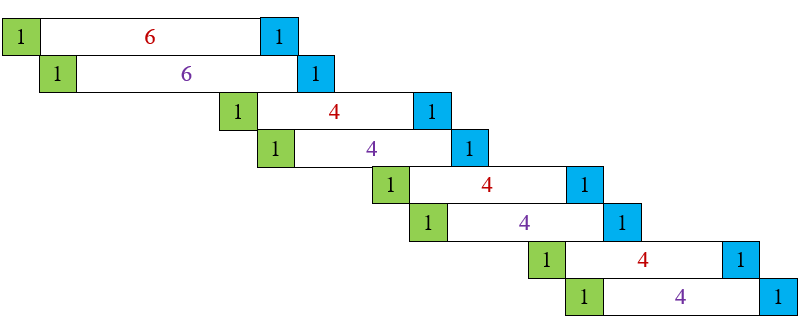

| **交叉存取**            |
| ----------------------- |
| 1+6+2×3+1×8=  21 cycles |

## 五.**二级存取器**

- 长期的非易失性存储
- 存储体系结构的底层：访问速度慢、容量大、便宜
- 带有磁性图层的可旋转的圆盘
- 通过可移动的读/写头来访问数据

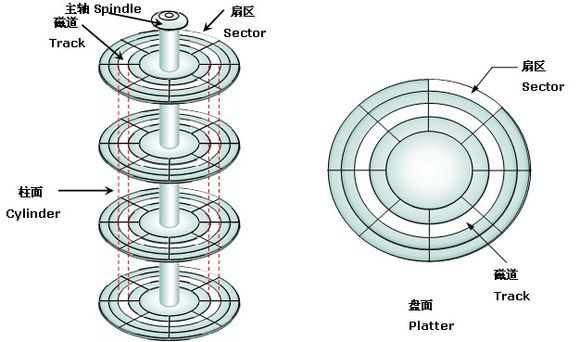

### **闪存（Flash Storage）**

磁盘替代者

固态硬盘（SSD）：基于闪存

非易失性，比磁盘快100~1000倍

磨损问题：采用磨损均衡技术

## 六.**小结**

- 处理器速度与存储器的访问速度间不匹配问题——存储墙
- 通用RAM类型：
  - SRAM、DRAM、SDRAM、DDR SDRAM
- 局部性原理：时间局部性和空间局部性
- 存储体系结构：
  - 寄存器->缓存->内存->磁盘->磁带