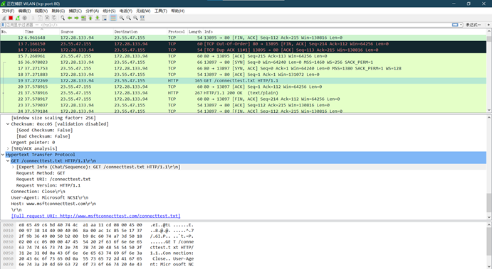
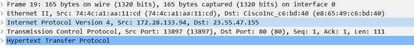
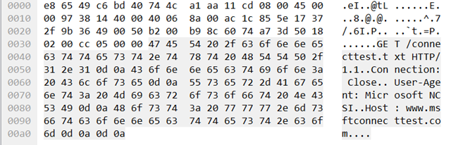
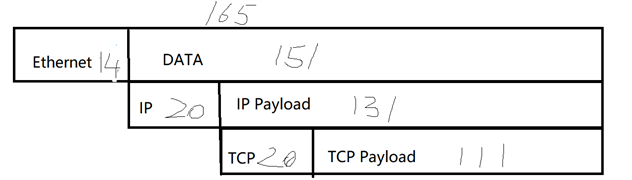
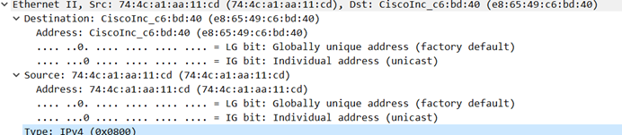
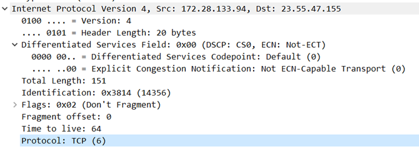
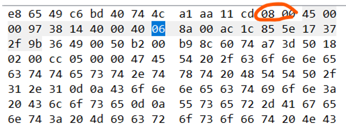
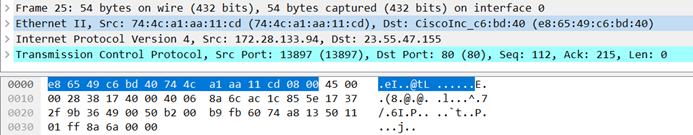

# 华东师范大学软件工程学院实验报告

| **实验课程**：计算机网络实践 | **年级**：2021级   | **实验成绩**：           |
| ---------------------------- | ------------------ | ------------------------ |
| **实验名称**：Protocol Layer | **姓名**：emokable |                          |
| **实验编号**：X              | **学号**：X        | **实验日期**：2022/11/17 |
| **指导教师**：章玥           | **组号**：         | **实验时间**：2022/11/17 |

## **一、实验目的**

1. 学习协议和分层如何用数据包表示; 

2. 熟悉wireshark软件、curl、wget等常用软件的使用，掌握网络抓包的方法，能在所用电脑上进 行抓包; 

3. 了解IP数据包格式，能应用该软件分析数据包格式，查看抓到的包的内容，并分析对应的IP数据 包格式; 

4. 抓包分析数据包，估算协议的开销; 

5. 通过数据包抓取实验，将理论与实践相结合，深入理解协议层的字段与结构特征.

## **二、实验内容与实验步骤**

1.安装wget和wireshark

2.使用软件抓包

3.启动Wireshark点击->捕获->选项->输入tab->选择本地网卡，过滤条件（所选择接口的捕获过滤 器）为 "tcp port 80"，在选项tab中勾选解析网络名称，点击开始按钮;关闭不必要的浏览器标签和窗口,避免跟踪非目的流量； 

4.在命令行中选取一个URL，用wget获取,打开Wireshark停止捕获。 (我选的网站为http://www.baidu.com)

5.查看Wireshark界面中的封包列表中如果出现数据包则说明抓包成功； 

6.分析抓包数据的结构

 

## **三、实验环境**

Windos10 22h2专业版

## **四、实验过程与分析**

### **抓包结果总览**

在抓取HTTP请求的GET方法时，分析其数据包，思考下列问题： 

1、根据抓取的HTTP请求的GET方法的抓取结果，分析协议包的内容。

2、画一个关于使用GET方法的HTTP请求的图(与下图类似)，为了显示协议层的嵌套结构，请分别标出Ethernet， IP和TCP协议的头部的位置、大小以及其负载的范围。

3、根据数据包的抓取结果，分析协议开销。

4、 估计协议的开销或者是协议开销占用下载字节的百分比。对于下载的主要部分中的每一个包，我们需要分析 Ethernet，IP和TCP的开销，和有用的HTTP数据的开销，你认为这种开销是必要的吗？ （假设HTTP数据（头部和消息）是有用的，而TCP，IP和Ethernet头部认为是开销。）

**Ans:**

协议包主要包含以下信息：

Frame:  物理层的数据帧概况

Ethernet II: 数据链路层以太网帧头部信息

Internet Protocol Version 4: 互联网层IP包头部信息

Transmission Control Protocol: 传输层T的数据段头部信息，此处是TCP

Hypertext Transfer Protocol: 应用层的信息，此处是HTTP协议

 

协议开销为分析 Ethernet，IP和TCP的头部大小之和即14+20+20=54

开销占比:54/165*100%=32.7%

这种开销是必要的,因为在网络的各层中存在着许多不同的协议，每个协议的定义与数据的划分都不相同，接收方和发送方的对等实体之间的协议必须保持一致，否则一方将无法识别另一方发出的信息，从而造成不可避免的灾难，增加的协议开销可以保证传输包的安全性和可检测性及可恢复性。

### **观察下载的以太网和IP头包回答下面问题** 

1、以太网头部中哪一部分是解复用（解复用： 找到正确的上一层协议来处理到达的包的行为叫做 解复用）键并且告知它的下一个高层指的是IP，在这一包内哪一个值可以表示IP？ 

2、IP头部中哪一部分是解复用键并且告知它的下一个高层指的是TCP，在这一包内哪一个值可以表示TCP？

**Ans:**

分析多路分解键，根据wireshark的功能，可以直接在下拉框找到IP、TCP协议对应的二进制符号

表示IP的解复用键为IPv4(0x0800)

表示TCP的解复用键为TCP(6)

### **思考题**:

1. 这里找到了一个54Bytes大小的tcp数据包，并且不包含更高层数据在TCP协议中，建立连接需要三次握手，结束连接需要4次挥手。这几次的数据传递均是不包括高层协议数据的，目的是为了确保连接建立的稳定和准确

2. MSS是TCP 数据包一次可以传输的最大数据段。在建立连接时二者协商MSS的大小。对于第一个包的首部中，Connection字段值为：keep-alive，表明后续仍有数据。最后一个包请求头中Connection字段值为：close，表明传输结束。同时最后一个包中还会包含FIN=1来请求关闭连接

3. 加密的目的是为了保密内容，所以加密的类型和加密密钥不能随着加密数据一同发送。加密协议的种类和密钥应该在传输数据前进行协商确定。相较于现有的直接传输，不同加密协议在传输之前需要有额外的数据传输进行密钥的协商，以确保整个加密是有效的

4. 和加密不同，压缩是为了节省传输流量，而非对数据保密内容，所以压缩的协议可直接指明在下层协议头中，便于接收方解压

## **五、实验结果总结**

总的来说,这次实验算是第一次对计算机网络抓包进行研究,一开始还不太清楚自己要做什么,问了助教之后自己又想了一会儿才将抓到的东西和课堂上将过的结构联系起来,然后就比较好分析了.