# 华东师范大学软件学院实验报告

| **实验课程**：计算机网络实践 | **年**级：2021     | **实验成绩**：            |
| ---------------------------- | ------------------ | ------------------------- |
| **实验名称**：ipv4           | **姓名**：emokable |                           |
| **实验编号**：X              | **学号**：X        | **实验日期**：2022/12/1   |
| **指导教师**：章玥           | **组号**：         | **实验时间**：13;00-14;30 |

 

## **一、实验目的**

​	1、学会通过Wireshark分析ip协议 

​	2、了解IP数据报的组成 

​	3、了解IP各部分的含义

## **二、实验内容与实验步骤**

​	1、获取IP packets 

​	2、分析IP packets 

​	3、分析Internet Path 

​	4、IP 报头checksum 计算

 

## **三、实验环境**

Windows10 22H2

Wireshark-win64-2.0.3

wget-1.17.1-win64

**Traceroute工具**

**traceroute**，现代Linux系统称为**tracepath**，Windows系统称为**tracert**，是一种电脑网络工具。它可显示数据包在IP网络经过的路由器的IP地址。

程序是利用增加存活时间（TTL）值来实现其功能的。每当数据包经过一个路由器，其存活时间就会减1。当其存活时间是0时，主机便取消数据包，并发送一个ICMP TTL数据包给原数据包的发出者。

程序发出的首3个数据包TTL值是1，之后3个是2，如此类推，它便得到一连串数据包路径。注意，IP不保证每个数据包走的路径都一样。

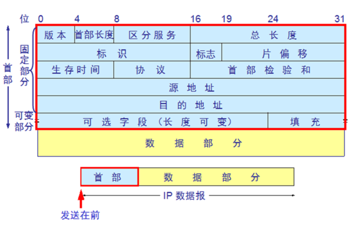

## **四、实验过程与分析**

### 实验步骤1-捕获IP Packets

​	1、 启动Wireshark，在菜单栏的捕获->选项中进行设置，选择已连接的以太网，设置捕获过滤器为“tcp port 80”，将混杂模式设为关闭,勾选 enable network name resolution.然后开始捕获。

 

​	2、 打开windows的命令行，在里面输入wget [www.sina.com](http://www.sina.com/)

​	3、停止捕获。

**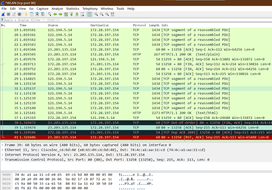**

### **实验步骤2-捕获Trace**

​	**1.启动Wireshark，在菜单栏的捕获->选项中进行设置，选择已连接的以太网，设置捕获过滤器为“icmp”，将混杂模式设为关闭,勾选 enable network name resolution.然后开始捕获。**

​	**2.执行 tracert www.baidu.com 。**

​	**3.** **当命令执行结束，则Wireshake中停止捕获，查看Wireshark界面中的封包列表中如果出现数据包则说明抓包成功；**

**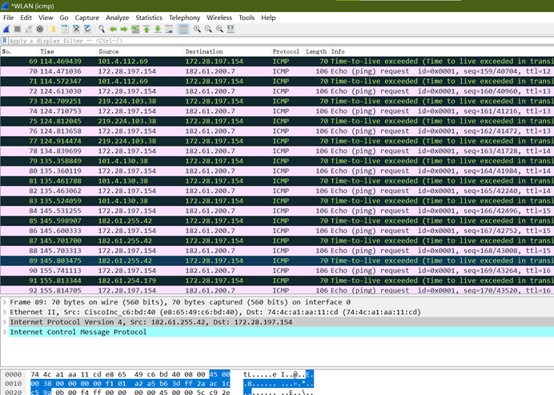** 

****

## **五、实验结果总结**

选择你通过Wireshark捕获到任何一个报文，分析其IP报文头部

**1、** 尽量不要打开教科书，请根据抓到的报文，描绘IP报文头的图片，并指出报文中每个fields的含义所在。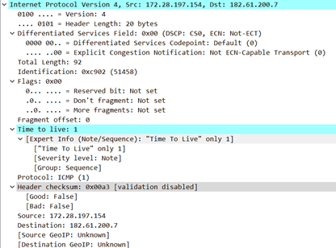

根据wireshark给出的报文结构,从左到右依次可描述为

版本信息(1-4),头部长度(5-8),服务类型作用域(9-16),总长(17-32),

标识码(33-34),标志(49-51),段偏移(52-64),

存活时间(65-72),下一个高层协议(73-80),头部校验和(81-96),

源地址(97-128),

目的地址(129-160)

 

### 通过观察Wireshark捕获的报文，来回答下面的问题：

**1.**   **你的计算机和远程服务器的IP地址是什么？** 

****

我的计算机ip为172.28.197.154,远程服务器为182.61.200.7

**2.“总长度”字段是否包括IP报头加上IP有效负载，或者仅包括IP有效负载？**

总长度包括ip报头与ip有效载荷。

**3.对于不同的数据包，“标识”字段的值如何变化，还是保持不变？例如，对于TCP连接中的所有数据包，它一直保持相同的值，还是对于每个数据包都不同？双向通信的报文是否相同？如果值发生变化，您能看到任何规律吗？**

标识字段值不相同，不同传输方向上部分相同。IPv4 头部中版本号、头部长度、段偏移这些值不变。IPv4 首部中总长度、标识码、生存时间、源地址、目的地址这些字段的值会变化。

 

### **通过观察Wireshark 捕获的报文，来回答下面的问题：** 

**4.**   **从您的计算机发送的数据包的TTL字段的初始值是多少？他们是maximum possible value吗？**

**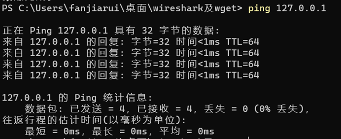**

我的笔记本TTL初始值为64. TTL字段maximum possible value为255，我的电脑值较低。

1. **查看数据包时如何判断它是否被分段？**

如果收到的IP报头中Don’t fragment为1，则未分片；如果收到的IP报头中Don’t fragment为0，则分片。如图则分片了。

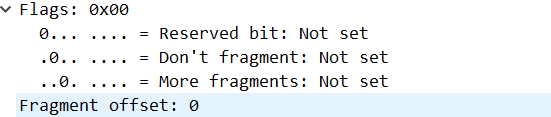

**6.**   **IP数据报报头的长度是多少，它是如何被编码进报头长度域的？**

IP数据报报头的长度为20个字节, 头部的前20byte为固定长度，所有IP 数据报必须具有。在头部的固定部分的后面是一些可选字段，其长度是可变的（在图中未画出）。头部中的源地址和目的地址都是IP 协议地址。IP 报头长度域（IHL）以32位字进行计数。当它的值为n时，其所表达的字节数为4n个。本次试验中，报头长度为20/4=5。

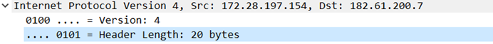

 

**观察traceroute的结果图，来进行结果分析：**

   **使用traceroute的结果，绘制网络路径图。**

**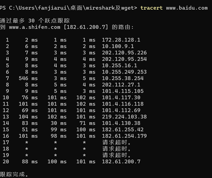** 

**图中，显示您的计算机（放在最左侧）和远程服务器（放在最右侧），均显示IP地址，以及它们之间的路径上的路由器，这些路由器以从本机开始的跳数作为距离编号。您可以在捕获的跟踪数据包中找到计算机和远程服务器的IP地址。**

**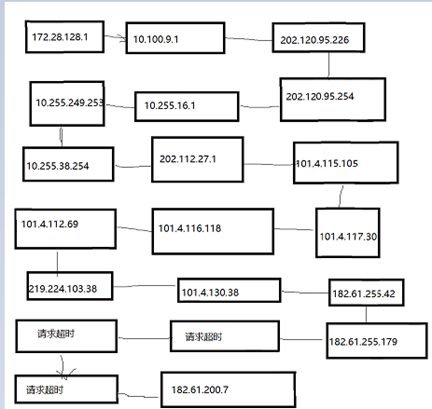**

**观察IP报文的校验和：**

**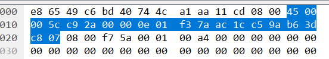**

蓝色部分为ipv4协议位置,得到4500 005c c92a 0000 0e01 f37a ac1c c59a b63d c807(f37a为校验和,求和时舍去),加之和为 checksum=40c81,将4加入,得0c85,取反即得到f37a,与实际校验值一致

1、IP报头的校验和可以用来验证一个数据包是否正确。选择一个从远程服务器发送到本计算机的包，计算它的checksum。在计算过程中，请添加注释，表明每个word对应的字段

计算对IP首部检验和的算法如下：

(1）把IP数据包的校验和字段置为0。

(2）把首部看成以16位为单位的数字组成，依次进行二进制求和（注意：求和时应将最高位的进位保存，所以加法应采用32位加法）。

(3）将上述加法过程中产生的进位（最高位的进位）加到低16位（采用32位加法时，即为将高16位与低16位相加，之后还要把该次加法最高位产生的进位加到低16位）。

(4）将上述的和取反，即得到校验和。

假设：抓个IP数据包，取IP数据报报头部分(20B)，数据如下

 *45 00 00 30 80 4c 40 00 80 06 b5 2e d3 43 11 7b cb 51 15 3d*

1 、把校验的两个字节变为0。

*45 00 00 30 80 4c 40 00 80 06 00 00 d3 43 11 7b cb 51 15 3d*

2、 每16位一加

*4500 + 0030 + 804c + 4000 + 8006 + 0000 + d343 + 117b + cb51 + 153d = 34ace*

3、把结果的高16位与低16位相加

*0003+4ace= 4ad1*

4、取反

4ad1 取反 就是最后的结果

### **在完成本实验后探索协议和分层，思考下列问题：**

•    **了解并尝试使用IPv6。 现代操作系统已经包含对IPv6的支持，因此您可能能够捕获网络上的IPv6流量。您还可以通过tunnels连接到IPv6**

**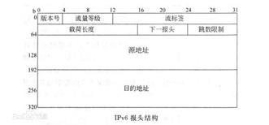**

使用icmp6过滤得到ipv6

**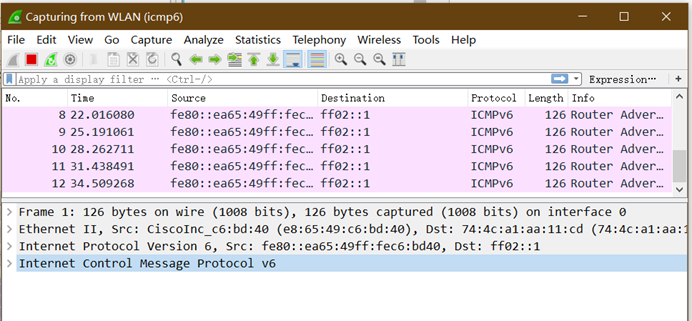**

•    了解tunnels技术。

•    隧道（Tunnel）技术是一种基于IPv4隧道来传送IPv6数据报文的封装技术。将IPv6包作为无结构意义的数据，封装在IPv4包中，如此穿越IPv4网络进行通信，并且在隧道的两端可以分别对数据报文进行封装和解封装。隧道是一个虚拟的点对点的连接。隧道技术在定义上就是指包括数据封装、传输和解封装在内的全过程。

•    **了解有关IP的地理位置信息，即IP地址和它对应的地理位置之间的信息**。

IP地理位置是使用IP地址识别设备（例如移动电话，小工具，笔记本电脑，服务器等）的地理位置,通过学校信息化办公室可以看到我现在笔记本电脑wlan连接网络的IP物理位置是在

亚洲 中国 上海 上海 华东师范大学 中北校区 校园无线

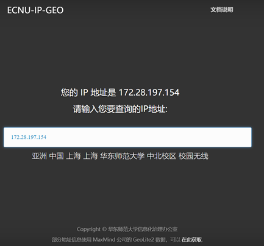

•    **了解IPsec或IP security.它为IP数据包提供机密性和身份验证，通常用作VPN的一部分。**

VPN（Virtual Private Network，虚拟专用网）是一种在公用网络上建立专用网络的技术。它之所以称之为虚拟网，主要是因为VPN的两个节点之间并没有像传统专用网那样使用端到端的物理链路，而是架构在公用网络如Internet之上的逻辑网络，用户数据通过逻辑链路传输。IPsec VPN是指采用IPsec实现远程接入的一种VPN技术，通过在公网上为两个或多个私有网络之间建立IPsec隧道，并通过加密和验证算法保证VPN连接的安全。

IPsec VPN保护的是点对点之间的通信，通过IPsec VPN可以在主机和主机之间、主机和网络安全网关之间或网络安全网关（如路由器、防火墙）之间建立安全的隧道连接。其协议主要工作在IP层，在IP层对数据包进行加密和验证。

相对于其他VPN技术，IPsec VPN安全性更高，数据在IPsec隧道中都是加密传输，但相应的IPsec VPN在配置和组网部署上更复杂。

 