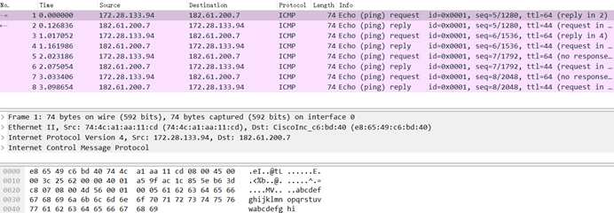
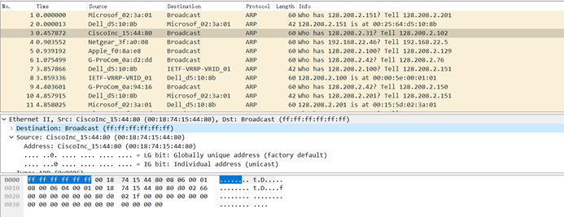

# 华东师范大学软件学院实验报告

| **实验课程**：计算机网络实践   | 年级：2021级       | **实验成绩**：           |
| ------------------------------ | ------------------ | ------------------------ |
| **实验名称**：实验二：Ethernet | **姓名**：emokable |                          |
| **实验编号**：X                | **学号**：X        | **实验日期**：2022/11/24 |
| **指导教师**：章玥             | **组号**：         | **实验时间**：2022/11/24 |

 

## **一、实验目的**

​	**1**、掌握网络抓包工具Wireshark、网络诊断工具ping的用法；

​	**2**、使用网络诊断工具ping触发网络消息；

​	**3**、使用网络抓包工具Wireshark获取并分析以太网数据帧；

​	**4**、掌握以太网帧的结构；

​	**5**、分析以太网地址范围；

​	**6**、分析以太网的广播帧。

## **二、实验内容与实验步骤**

​	1、启动Wireshark，在菜单栏的捕获->选项中进行设置，选择已连接的以太网，设置捕获过滤器为“icmp”，将混杂模式设为关闭,勾选 Resolve MAC addresses然后开始捕获。

​	2、打开命令行，输入ping www.baidu.com.

​	3、打开Wireshark， 停止捕获。

## **三、实验环境**

Windows10 22H2

Wireshark-win64-2.0.3

wget-1.17.1-win64

## **四、实验过程与分析**

1. 单播

设置完wireshark后在windows终端输入ping baidu.com

打开wireshark截获:

2.组播,广播

​	广播：一对所有主机

​	组播：一对部分主机

使用“**ether multicast**”过滤器开始对广播和多播以太网帧进行捕获，等待30秒记录背景流量，然后停止捕获。(受实验室限制,使用现有抓包)

## **五、实验结果总结**

### **分析以太网单播帧：**

1.基于对以太网帧格式的理解，绘制ping消息的图形，该图形以字节

单位显示以太网报头字段的位置和大小。图形可以简单地将框架显示为一个细长的矩形。先出现在包中的是最左边的字段，会先通过网络发送。在此图中，显示以太网报头和以太网负载的范围。最后添加一个虚线框来表示4字节校验和。

以太网结构图(以抓到的包为例):

 

2、画一个图,显示你的电脑,路由器和远程服务器的相对位置。标记你的电脑和路由器的以太网地址。标记你的计算机和远程服务器的IP地址。同时也在绘图中显示出以太网和其他网络。

Icmp包显示地址与本机一致

可画出图案:

### **分析以太网广播帧或多播帧的格式回答下面问题：**

1.以太网广播帧的地址是什么,以Wireshark显示的标准形式写出。

Broadcast（ff:ff:ff:ff:ff:ff）

2.哪几个比特位的以太网地址是用来确定是单播或多播/广播的?可以根据地址第8位判断是单播还是多播/广播。如果为0则是单播，如果为1则是多播。如果地址均为1，即地址为ff.ff.ff.ff.ff.ff，则为广播

### **IEEE 802.3数据包分析**：

有两种类型的以太网帧，IEEE 802.3和DIX以太网。 DIX是常见的，也是我们上面实验中用到的，而IEEE 802.3则很少。 您可能会在捕获的抓取的包中看到一些IEEE 802.3帧。要搜索IEEE 802.3数据包，请输入显示过滤器（在Wireshark窗口的顶部面板上方）“ llc“ （小写），因为IEEE 802.3格式在其顶部具有LLC协议。 LLC也存在于IEEE 802.11无线网络之上，但在DIX以太网中却不存在。(如果一直没有IEEE 802.3的数据包，可以打开混杂模式，然后开始捕获。)

​	1.与DIX以太网报头相比，IEEE 802.3和LLC组合报头有多长？您可以使用Wireshark解决此问题。请注意，Trailer / Padding和Checksum可能显示为标头的一部分，但它们位于帧的末尾。

802.3报头长14字节(目的地址6,源地址6,长度/类型2),LCC报头(DSAP 1, SSAP 1, 控制1)3字节,一共17字节

2. 接收方计算机如何知道该帧是DIX以太网还是IEEE 802.3？ 提示：您可能需要同时使用Wireshark查看数据包示例并查找相关文献。

当Type字段值小于等于1500（0x05DC）时，帧使用的是IEEE 802.3格式。当Type字段值大于等于1536（0x0600）时，帧使用的是Ethernet II(DIX)格式

3. 如果IEEE 802.3没有类型字段，那么如何确定下一层？使Wireshark查找解复用键

802.3没有类型字段,但可以通过长度length来判断,因此0000-05DC都可以看作是802.3的解复用键,此处的解复用键就是0026

## **六.个人总结**

这次实验算是做得比较容易的了,但是由于wlan的原因,后面的数据包都用的教材给的,算是丧失了一些实验的乐趣.