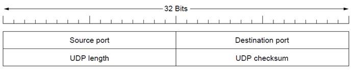
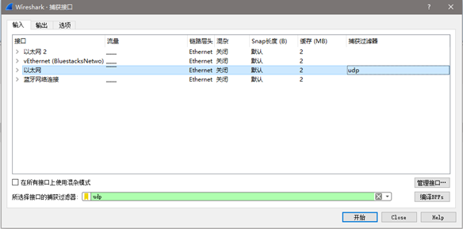
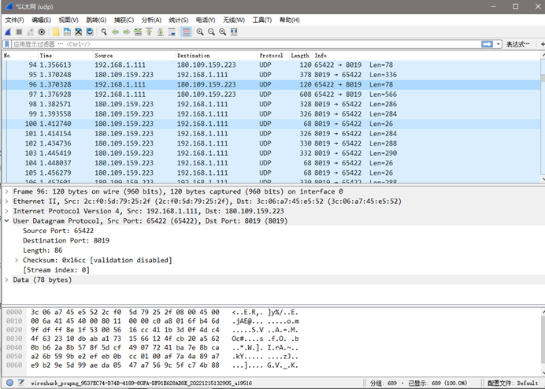
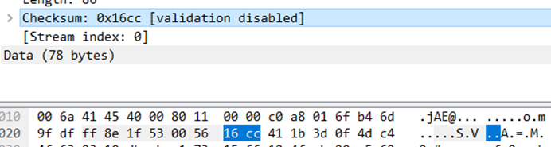
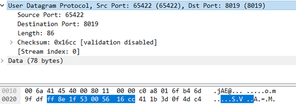
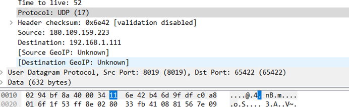
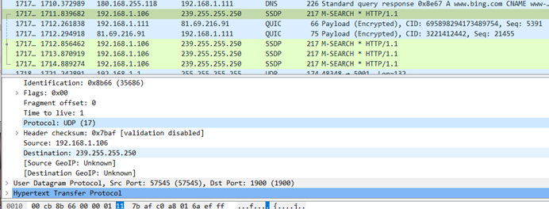

# 华东师范大学软件学院实验报告

| **实验课程**：计算机网络实践 | **年级**：2021级   | **实验成绩**：           |
| ---------------------------- | ------------------ | ------------------------ |
| **实验名称**：UDP            | **姓名**：emokable |                          |
| **实验编号**：X              | **学号**：X        | **实验日期**：2022/12/15 |
| **指导教师**：章玥           | **组号**：         | **实验时间**：2022/12/15 |

 

## **一、实验目的**

1. 学会通过Wireshark获取UDP消息
2. 掌握UDP数据包结构

3. 掌握UDP数据包各字段的含义

4. 了解UDP协议适用领域

## **二、实验内容与实验步骤**

UDP报文头部结构：

****

## **三、实验环境**

Windows 10 专业版21H2

Wireshark-win64-2.0.3

wget-1.17.1-win64

## **四、实验过程与分析**

1. 启动Wireshark，在菜单栏的捕获->选项中进行设置，选择已连接的以太网，设置捕获过滤器为“udp”，关闭混杂模式；

****

   2.点击开始，打开浏览器，在地址栏中输入网址浏览，例如www.baidu.com； 

3. 打开Wireshark， 停止捕获；

4. 查看Wireshark界面中抓取的UDP数据包。

****

## **五、实验结果总结**

### **通过查看UDP消息的详细信息，回答以下问题：**

 

1、 UDP数据包头中的Length字段包括哪些部分？UDP有效载荷，还是UDP有效载荷加上UDP头部的总长度，还是UDP有效载荷和UDP头部以及低层协议的头部三者总长度？

UDP数据包头部中的length指的不是UDP有效载荷，而是有效载荷加上UDP头的长度。

2、 UDP校验和为多少位？

****如图，2个字节。

3、 整个UDP头部的长度为多少字节？

8个字节

### **为了了解UDP在实践中是如何进行传输的，观察数据包的IP头部并思考以下问题：** 

1、 将上层协议标识为UDP的IP头部的协议字段值为多少？

 ****

UDP值为0x11，十进制17.

2、查看源IP地址与目的IP地址都不是你的计算机的IP地址的数据包，并给出这些数据包的目的IP地址。

****

目的ip：239.255.255.250

百度得知是由于路由器上开了UPnP服务，而这个服务会用SSDP（简单服务发现协议）就是用239.255.255.250的多播地址端口1900来发现UPnp服务，局域网内某台电脑上如果有UPnP服务，每隔一段时间这台机器就会向该多播地址宣告服务在网络上可取，而发送的方式就是基于UDP的HTTP多播方式。

 

3、一般UDP消息的长度为多少？

标识UDP长度为2个字节，共16位，故最大可有0xffff,65535字节。UDP长度包含20字节的IP头部，故UDP全长不超过65515字节，这其中包含8个字节的UDP头部长度，故实际载荷最大不超过65507字节。

 

### **在完成本实验后继续探索UDP协议：**

了解基于UDP的应用程序的流量，查看数据包大小和丢失率。

探索流和实时应用程序，查看哪些使用UDP以及哪些使用TCP进行传输。

Udp: 面向非连接的(正式通信前不必与对方建立连接，不管对方状态就直接发送，像短信，QQ)，不能提供可靠性、流控、差错恢复功能。

TCP: 面向连接、传输可靠(保证数据正确性,保证数据顺序)、用于传输大量数据(流模式)、速度慢，建立连接需要开销较多(时间，系统资源),http使用tcp

 

## **六.个人总结**

这次是在宿舍台式机上做的实验，总算能用以太网