# 华东师范大学软件学院实验报告

| **实验课程**：计算机网络实践 | **年级**：21级     | **实验成绩**：            |
| ---------------------------- | ------------------ | ------------------------- |
| **实验名称**：TCP            | **姓名**：emokable |                           |
| **实验编号**：X              | **学号**：X        | **实验日期**：12月22日    |
| **指导教师**：章玥           | **组号**：         | **实验时间**：13:00-14:30 |

 

## **一、实验目的**

1. 熟悉使用wireshark软件进行抓取TCP数据包 ；

2. 分析抓取到的TCP数据包，掌握TCP数据包结构；

3. 掌握TCP数据包各字段的含义；

4. 掌握TCP连接建立和释放的步骤；

5. 掌握TCP数据传输过程；

 

## **二、实验内容与实验步骤**

**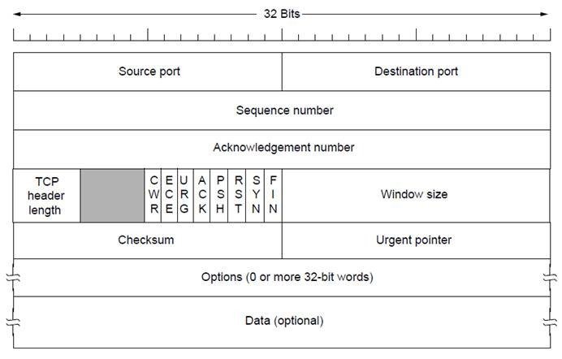**

1. 以http://old.ecnu.edu.cn/site/xiaoli/2016.jpg为例，使用wget确认URL有效，或者使用你感兴趣的URL；

2. 启动Wireshark，在菜单栏的捕获->选项中进行设置，选择已连接的以太网，设置捕获过滤器为tcp and host xx.xx.xx，xx.xx.xx是要从中获取内容的服务器名称，如上述例子中的old.ecnu.edu.cn；

3. 捕获开始后，重复第一步，重新发送请求；

4. 命令完成后，停止捕获。

 

## **三、实验环境**

Windows10 21H2

Wireshark-win64-2.0.3

wget-1.17.1-win64

## **四、实验过程与分析**

输入wget http://old.ecnu.edu.cn/site/xiaoli/2016.jpg 确认该链接无效

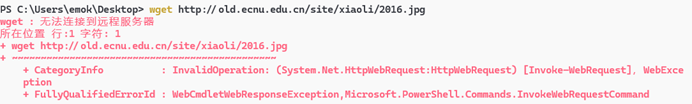

换一个试试wget http://staff.ustc.edu.cn/~zuojin/arts/19840205.pdf（随便找的pdf文件）

 

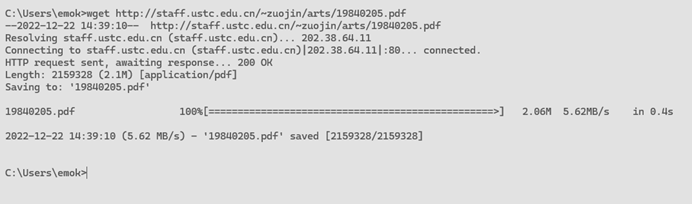

启动Wireshark，在菜单栏的捕获->选项中进行设置，选择已连接的以太网，设置捕获过滤器为tcp and host staff.ustc.edu.cn，我们主要观察客户端与服务器之间的tcp流。如图

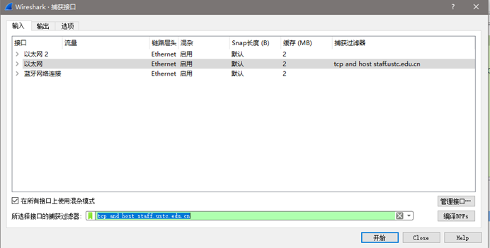   

当wget命令结束后，停止wireshark捕获，得到

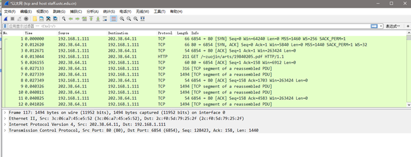

 

 

## **五、实验结果总结**

1、根据你的理解，绘制TCP报文段的结构图（包括头部各字段的位置及大小）。

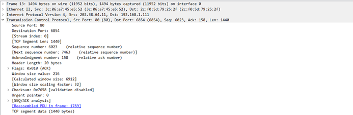

源端口2byte -目的端口2byte

序列号4byte

确认号4byte

Flags 2byte 窗口2byte

检验和2byte 紧急指针2byte （以上位固定首部20byte）

长度2byte  tcp分段信息1440byte

Tcp段共计1460字节

### **在你捕获到的结果中，找到设置了SYN标志的TCP段及其后的数据包，完成以下问题：** 

1、 绘制三次握手的时序图，直到并包括建立连接后计算机发送的第一个数据包（HTTP GET请求），包括

•    每个数据段的序列号和Ack标号；

•    本地计算机发送或接收每个数据段的时间（以毫秒为单位）；

•    本地计算机从发送SYN段到接收到SYN-ACK段的往返时间；

2、SYN数据包上携带哪些TCP 选项？

3、传输完成后，TCP连接会以四次挥手或一端发送RST数据包的方式断开，同1一样，绘制TCP连接释放的时序图（从发出第一个FIN或RST到连接断开为止）。

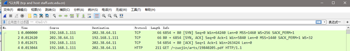

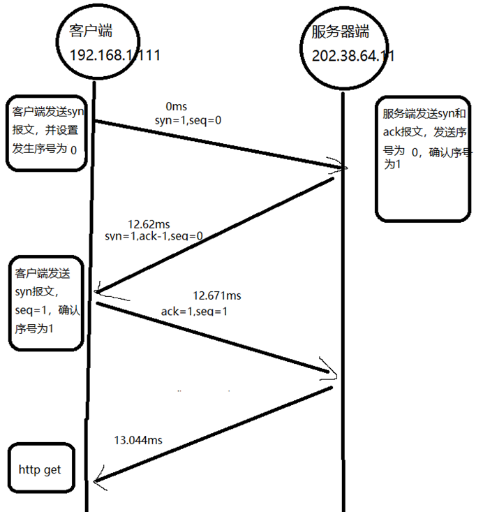

往返时间12.62ms

含有以下tcp选项，共12bytes

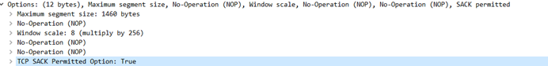

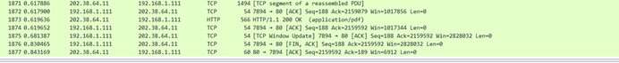

找不到四次挥手的数据包，只有两次挥手，重新按照提供的实验案例来分析

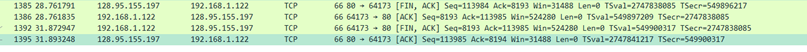

   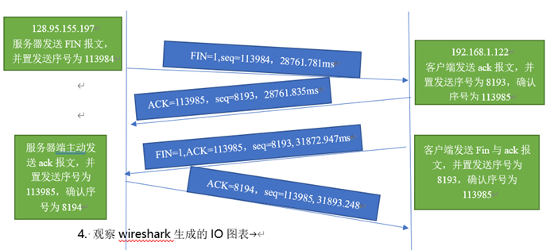

4. 观察wireshark生成的IO图表  

### **在“统计”菜单下，选择“IO图表”，以查看数据包速率。**

•    调整过滤器为“tcp.srcport==80”仅查看下载数据包，重新绘图；

•    调整过滤器为“tcp.dstport==80”仅查看上传数据包，重新绘图；

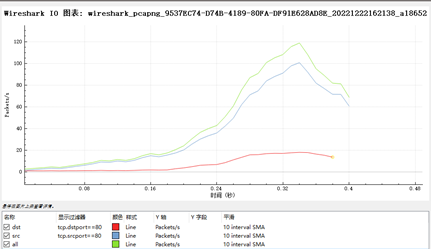

**通过你对数据传输的理解，回答以下问题：**

1、    实验中下载的大概速率为多少？（以packets/s和bits/s为单位）

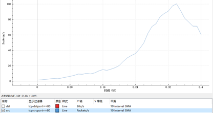

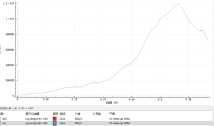

下载速率最高100packets/s，1.2*10^6bits/s

2、    下载内容（即TCP有效负载）占下载率的百分比是多少？

筛选srcport==80，选取其中一个数据包

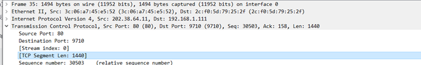

1440/1494=96.64%

3．实验中上传的大概速率为多少？（以packets/s和bits/s为单位）

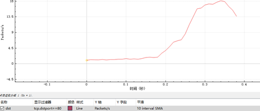

最高18packets/s，7800bits/s

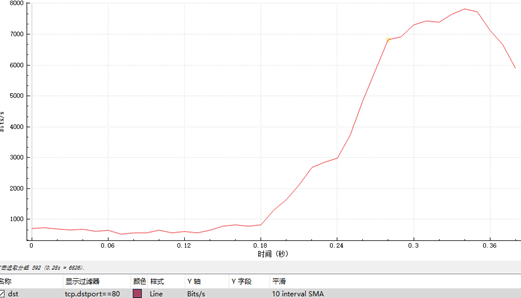

 

4. 如果最近从服务器收到的TCP数据段的序列号是X，那么下一个发送TCP报文中的Ack号是多少？

X+n，n为数据长度字节数

 

### **在完成本实验后继续探索TCP协议：**

•    探索TCP的拥塞控制和经典AIMD策略。

TCP 采用基于窗口的方法进行拥塞控制。该方法属于闭环控制法。TCP发送方维持一个拥塞窗口 CWND (Congestion Window)。拥塞窗口的大小取决于网络的拥塞程度，并且动态地在变化。只要网络没有出现拥塞，拥塞窗口就可以增大，发送更多分组，提高网络的利用率。但只要网络出现拥塞或有可能出现拥塞，减小拥塞窗口，减少分组数，缓解网络拥塞

 

 

 

更深入地探索TCP的可靠性机制。捕获包括段丢失的TCP连接，查看什么触发重新传输以及何时触发，另外查看往返时间估算工具。

触发超时重传：发送的请求报文没有到达对方；对方发送的ACK报文没有接收到速重传机制快速重传机制不以时间为驱动,而是以数据驱动为驱动.SACK/d-sack，滑动窗口

 

•    查看包括SACK在内的选项的使用以了解详细信息。

SACK是一个TCP的选项，来允许TCP单独确认非连续的片段，用于告知真正丢失的包，只重传丢失的片段。要使用SACK，2个设备必须同时支持SACK才可以，建立连接的时候需要使用SACK Permitted的option，如果允许，后续的传输过程中TCP segment中的可以携带SACK option，这个option内容包含一系列的非连续的没有确认的数据的seq range。 

 

•    TCP是Web的基础传输层。可以通过设置并发连接来查看浏览器如何使用TCP。

 

 

## **六、总结**

学会通过 Wireshark 获取 TCP 消息，对TCP的连接（三次握手）和释放过程（四次挥手）有了更深的理解。了解了TCP数据包各字段的含义，掌握了TCP连接建立和释放的步骤，掌握了TCP数据传输阶段的过程。对TCP包头的结构更了解了。不过在实验抓包中发现有些http链接抓不到四次挥手，于是也部分借用了标准案例里的抓包来分析。

还有就是i/o图表还是有些不一样，总感觉很怪。

----------------------------------------------------------------------------------------------------------------------------------------

这个系列就到此为止,这学期操作系统的资料在学校电脑上而且很烦杂,回家懒得弄了...