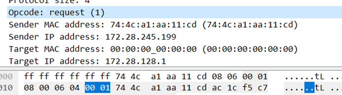

# 华东师范大学软件工程学院实验报告

| **实验课程**：计算机网络实践 | 年级：2021级       | **实验成绩**：          |
| ---------------------------- | ------------------ | ----------------------- |
| **实验名称**：实验四：ARP    | **姓名**：emokable |                         |
| **实验编号**：X              | **学号**：X        | **实验日期**：2022/12/8 |
| **指导教师**：章玥           | **组号**：         | **实验时间**：13:00     |

 

## **一、实验目的**

1. 学会通过Wireshark获取ARP消息

2. 掌握ARP数据包结构

3. 掌握ARP数据包各字段的含义

   

4. 了解ARP协议适用领域

## **二、实验内容与实验步骤**

### 获取ARP消息

1.使用管理员权限打开命令行

2.输入ipconfig /all，可以获得本地计算机的物理地址

3.输入netstat –r，可以获得本机路由表

4.输入arp –a，可以查看ARP cache

5.输入arp –d，可以清空ARP cache

 

### 获取ARP消息

1.启动Wireshark，在菜单栏的捕获->选项中进行设置，选择已连接的以太网，设置捕获过滤器为ARP，将混杂模式设为关闭

2.点击开始

3.清空ARP cache

4.停止捕获

5.在显示过滤器中输入“eth.addr==以太网地址”

 

## **三、实验环境**

Windows10 22H2

Wireshark-win64-2.0.3

wget-1.17.1-win64

## **四、实验过程与分析**

打开命令行，输入ipconfig /all获得本机物理地址。(笔记本使用wlan网络)

 

****

输入netstat –r，获得本机路由表

1. 启动Wireshark，在菜单栏的捕获->选项中进行设置，选择已连接的以太网，设置捕获过滤器为ARP，将混杂模式设为关闭

2.点击开始

3.输入命令 arp –d ，清空arp存储。然后利用命令arp –a 检查是否成功清空了arp存储

输入arp –a，查看ARP cache

使用管理员权限打开命令行,才能执行清空arp表的命令

4.然后浏览任意的网页，促使arp表更新。

5.在wireshark中捕获了arp报文之后，使用wireshark停止捕获。

 

## **五、实验结果总结**

1、通过语句“eth.addr==01:02:03:04:05:06”的形式，在wireshark中设置过滤器，找出与自己mac地址相关的arp报文。 Arp报文包括请求报文和应答报文，仔细分析两种报文的格式。

**请求:**

**应答:**

具体比较第3题有详细分析

2.画出你的计算机和本地路由间ARP的请求和应答数据包，标记出请求和应答，为每个数据包给出发送者和接受者的MAC和IP地址。

3. 分析报文，回答问题：

   a.什么样的操作码是用来表示一个请求？应答呢？

Opcode :0x0001表示请求

Opcode :0x0002表示应答

****

   b.一个请求的ARP的报头有多大？应答呢？

硬件类型：2字节 协议类型：2字节
 硬件长度：1字节 协议长度：1字节

Opcode：2字节   共8字节

硬件类型：2字节 协议类型：2字节
 硬件长度：1字节 协议长度：1字节

Opcode：2字节  共8字节

 

 

   c.对未知目标的MAC地址的请求是什么值？

以太网报头中为ff:ff:ff:ff:ff:ff

ARP中为00:00:00:00:00:00 

 

d.什么以太网类型值说明ARP是更高一层的协议？

以太网中的type为ARP，表明ARP为更高一层协议。

f.ARP应答是广播吗？

不是,是单播(只有请求是广播)

 

### 在完成本实验后，思考下列问题：

去除过滤器，我们发现还有更多的arp报文。请研究这些额外的arp报文中，有什么其他的功能作用。

这些报文有的是别的主机发起的请求和回复,还有Gratuitous ARP也称为免费ARP。Gratuitous ARP不同于一般的ARP请求，它并不是期待得到IP相应的MAC地址，而是当主机启动的时候，将发送一个Gratuitous arp请求，即请求自己的IP地址的MAC地址.

 