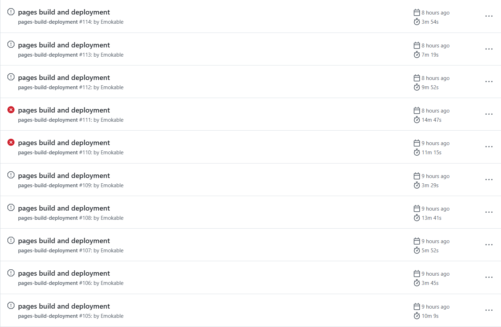
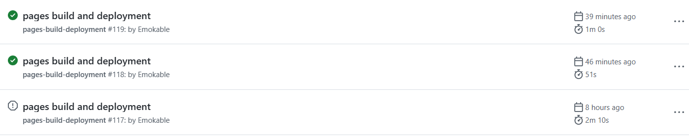

## 一.错误表现

昨天晚上,我像往常一样,写完博客准备上传到Github,结果过了半天博客页面还没有刷新,点开仓库一看,文件已经更新了,但是action栏全是提交失败

出错的具体表现都是deploy超时

点开的显示排队中...

## 二.解决方法(伪)

我一开始就认为可能是插件错误,然后折腾了半天,先试着把昨天晚上下载的插件给卸了,再上传,失败.把之前备份的版本回退,上传也失败,最后反反复复的弄到了差不多凌晨2点半,中途还把博客搞崩了(网页因为提交不上去而404),最后放弃了打算第二天重新部署hexo博客了...

## 三.解决方法(?)

~~最后的解决方法就是什么也不做~~

~~一眼丁真,鉴定为服务器抽风~~

今天早上提交一遍就传上去了,不然你也看不到这篇文章了

