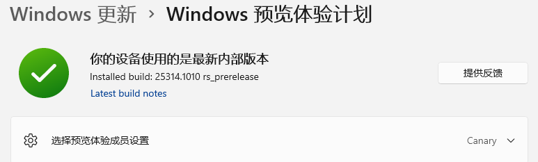
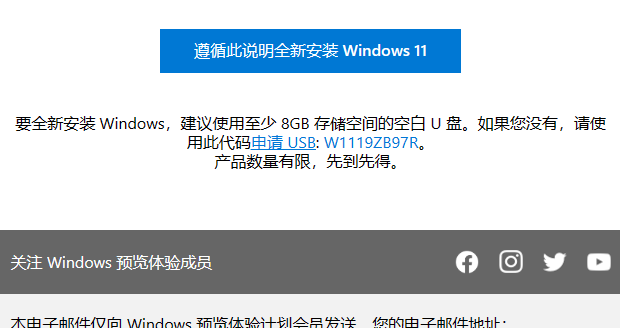
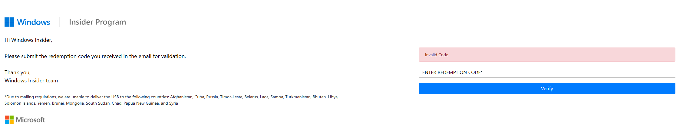

# 一.起因

今天逛贴吧，突然刷到说微软会给win11 canary通道的测试者开放申请渠道，发u盘用于后续的系统安装，还说高于build25000的会员就会自动转canary。

我马上打开设置看，我不就是吗？

于是立刻翻看邮件，居然在几天前就给我发了消息了

点击链接会跳到一个登记表页面，中国大陆是可以传的，填写之后又发送了一个确认邮件

> *Due to mailing regulations, we are unable to deliver the USB to the following countries: Afghanistan, Cuba, Russia, Timor-Leste, Belarus, Laos, Samoa, Turkmenistan, Bhutan, Libya, Solomon Islands, Yemen, Brunei, Mongolia, South Sudan, Chad, Papua New Guinea, and Syria。
>
> 中国大陆是可以送达的

# 二.耐心等待吧

。。。。。。