## 一.外观及拆解

这个随身wifi淘宝购入,花费14.5大洋,算不上车价,我也是突发兴趣去买的.不过看这个棒子早己被各路大佬玩开花了,我弄这个也没啥技术含量,没有卡槽就没必要搞基带了,只刷个debian,就当是分享经验算了.....

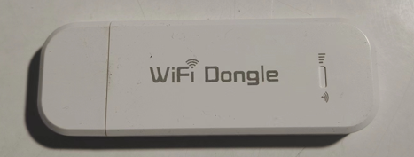

用螺丝刀拧开两个小螺丝

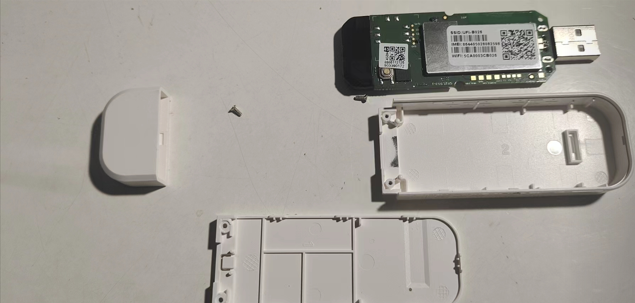

然后查看板子丝印,这一步是为了确定我们要刷的包,410的棒子大致有UFI001,UFI002,UFI003等种类

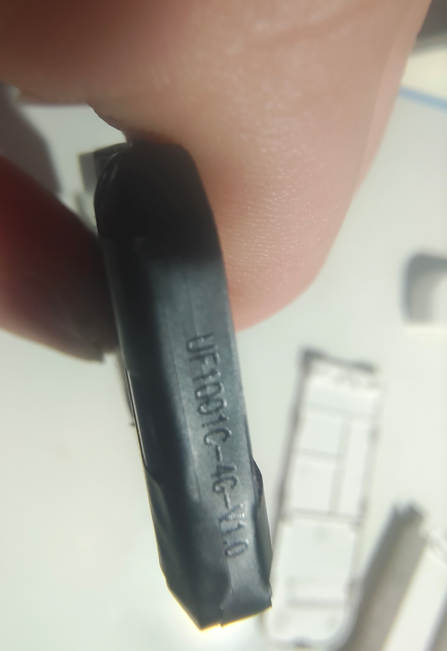

然后我们可以看一下他的CPU,拆开最大的屏蔽罩,确定是高通410,旁边是金士顿的什么颗粒(应该是4G的硬盘)

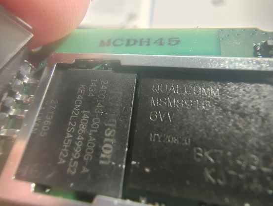 

我买的运气不好,没有卡槽,除非自己焊一个上去(我一个软件学生表示不会),否则不能用自己卡,旁边按钮是复位键,待会儿进入9008模式需要用

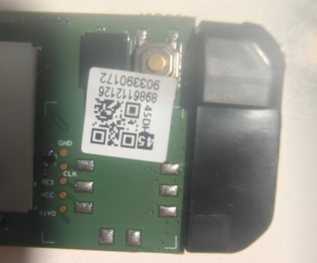

棒子的具体配置：

| 项目 | 参数                                                        |
| ---- | ----------------------------------------------------------- |
| CPU  | Qualcomm Snapdragon MSM8916 Cortex-A53 × 4 @ 1.2GHz         |
| RAM  | 512MB                                                       |
| ROM  | 4G                                                          |
| 备注 | CPU 即高通骁龙 410，是采用 28nm 工艺制程的 64 位 4 核处理器 |

这个cpu性能大致和树莓派3+接近...

## 二.备份

所需软件链接: https://pan.baidu.com/s/1eiWrcMONoO8jDhCxfVlKMg 提取码: dttr 

#### 1.首先在电脑上安装9008驱动


有了驱动才能进入9008模式，我们才能备份

#### 2.下载好两个备份/刷写软件

在我们真正刷写前,先做好备份,避免刷机变砖


两个软件都可以备份,miko可以生成单个文件的救砖包，高通那个可以单独对分区备份和写入


首先保持按住wifi棒子上的复位键，插入电脑的usb口，驱动正确的情况下，打开电脑的设备管理器，端口栏会出现这个9008的标识。

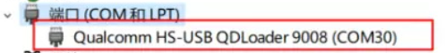

此时wifi棒子不会发光。

如果想单独对分区操作，进入高通软件，点击QUalcomn->partition->do job(scan)

成功后，左侧会显示棒子信息，右侧会出现棒子自带安卓系统的分区，点击需要操作的分区，选择backup(备份)或者write(写入)，我们就可以操作了（注意先scan再操作）.

如果想玩安卓，但棒子默认没开adb，也可以从这里提取system文件，利用rom操作软件直接添加环境变量再写入（我的棒子就是，但我通过这番操作已经开了adb了），可以参考这个up的视频https://www.bilibili.com/video/BV1C24y1Q7fN?share_source=copy_web


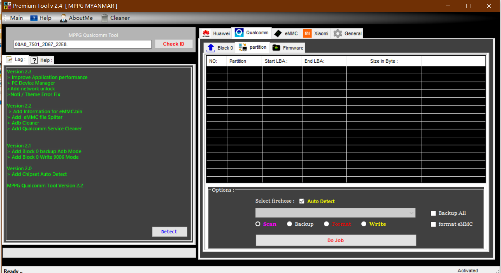

miko软件的使用也类似，在9008模式下。

选择Read，Partition Backup/Flash，选择生成路径，点击Load Partition Structure，再点击Read Full Image生成emmc全备份文件格式.bin，之后玩砖了直接刷进去就行。

>  如果要插卡玩，记得备份基带。                                                                                                                                           

## 三.debian刷入

酷安大佬[苏苏小亮亮](https://www.coolapk.com/feed/36547490?shareKey=MDk1MjQ1Zjg1OTk1NjJkZjYzMDg)的debian和openwrt固件

刷之前先确定棒子已开启adb，使用命令 `adb devices` 查看连接的adb设备，如果报错说明驱动未安装，那就先安装驱动，如果为空行，说明棒子没开adb

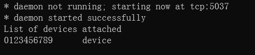

然后下载对应固件包，解压

点击flash.bat

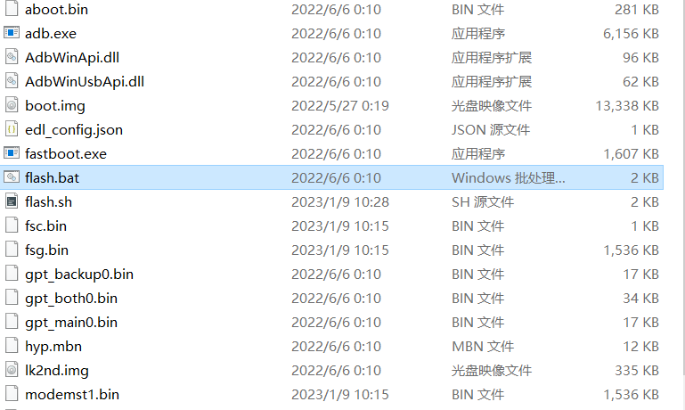

点开效果，如果adb连上了会帮你开启bootloader，我这是早就弄完的了，所以没有别的显示，如果正常随后一直按提示回车就安装好了

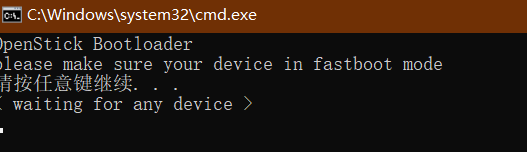

此时使用`adb shell`指令便可直接连上linux了，但我们的目的还没有完全实现，目前还不能通过ip来访问

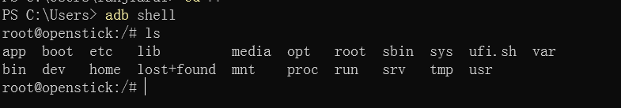

再次打开设备管理器，我们会发现其他设备一栏有警告

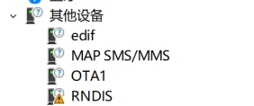

右键属性选择更新驱动，浏览电脑->可用程序列表中选择

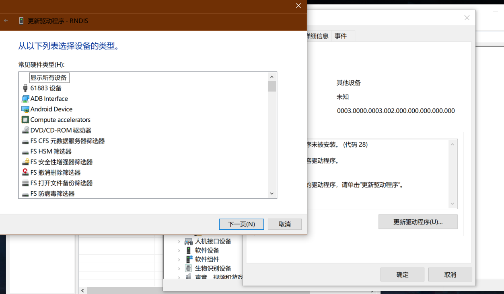

网络适配器->microsoft->基于NDIS，直接安装

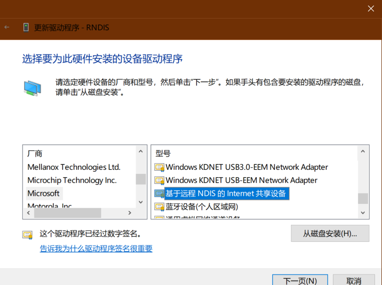

装完后就能识别了

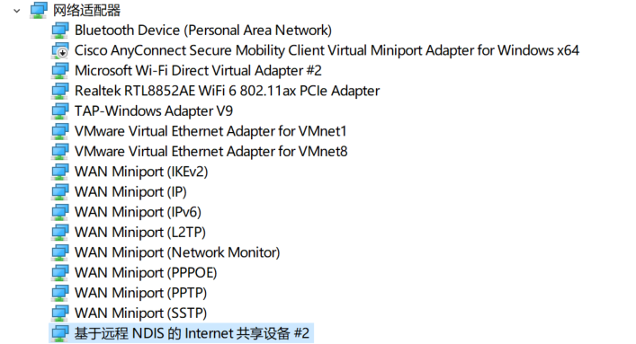

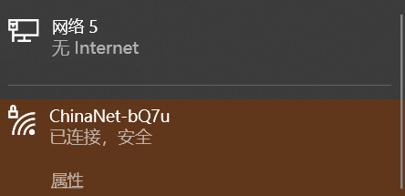

我们直接在cmd输入

```
ssh root@192.168.68.1
```

默认密码为1

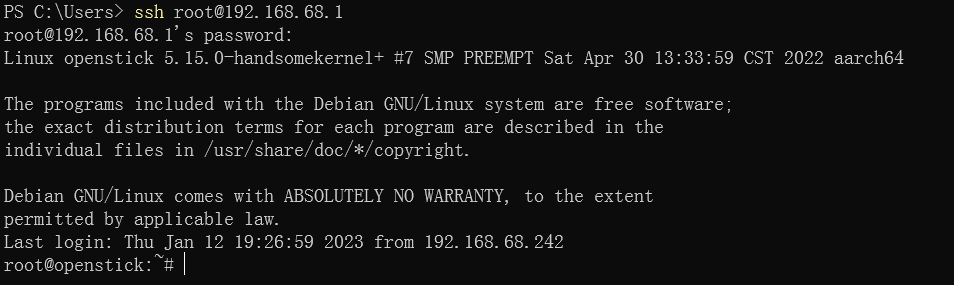

成功连上！之后就用`nmtui`命令联网，当作正常linux系统使用就行了

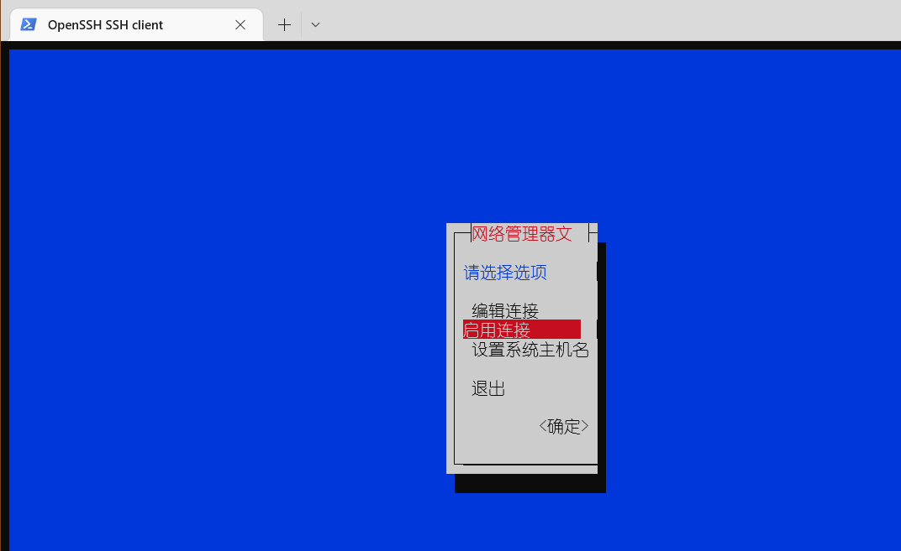